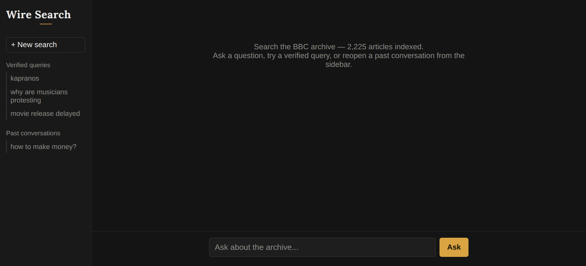

# Wire Search

> An AI-powered hybrid search and Q&A engine over the BBC News archive — semantic search, keyword search, and RAG-based answers with source citations, built as a hands-on AI Engineering portfolio project.


**Live demo:** [AI-Powered Search Engine](https://ai-powered-search-engine-rosy.vercel.app)

---

## Table of Contents

- [Introduction](#introduction)
- [Demo / Screenshots](#demo--screenshots)
- [Features](#features)
- [Tech Stack](#tech-stack)
- [System Requirements](#system-requirements)
- [Installation](#installation)
- [Configuration](#configuration)
- [Usage](#usage)
- [Project Structure](#project-structure)
- [Data & Evaluation](#data--evaluation)
- [Testing](#testing)
- [Deployment](#deployment)
- [Troubleshooting](#troubleshooting)
- [Roadmap](#roadmap)
- [Contributing](#contributing)
- [References](#references)
- [License](#license)
- [Contact](#contact)
- [Acknowledgments](#acknowledgments)

---

## Introduction

**Wire Search** is a semantic search engine and RAG-based Q&A assistant built on top of a 2,225-article BBC News archive. It lets you ask natural-language questions — including follow-up questions that reference earlier turns — and get back an answer grounded in the actual archive, along with the specific articles it was drawn from.

It combines **dense (semantic) embeddings** and **sparse (BM25 keyword) search** in a single hybrid retrieval pipeline, so it handles both paraphrased questions ("why are musicians upset about downloading?") and exact-term lookups (proper nouns, rare terms) that pure semantic search alone tends to miss.

This project was built as a hands-on learning exercise in AI Engineering — end to end, from data ingestion and chunking, through embeddings and vector search, to a full RAG pipeline, conversation memory, evaluation, and a real free-tier production deployment.

## Demo / Screenshots



The interface uses a "newsroom wire" visual theme — a sidebar with quick-start verified queries and past conversations, and a chat-style main panel showing each answer alongside its retrieved sources (article ID, category, relevance score).

## Features

- Hybrid retrieval — dense semantic embeddings + BM25 sparse embeddings, fused via Reciprocal Rank Fusion (RRF) in Qdrant
- RAG-based Q&A — retrieved article chunks are injected into the LLM prompt to generate a grounded answer instead of relying on the model's own memorized knowledge
- Conversational memory — follow-up questions are understood in context; a query-rewriting step turns context-dependent follow-ups ("what category is that in?") into standalone search queries before retrieval
- Conversation persistence — past conversations are stored in SQLite and can be reopened instantly without re-running any AI pipeline
- Evaluation framework — a hand-labeled "golden set" (grouped by query type: proper nouns, paraphrases, general questions) measures Recall@k, MRR, and Precision@k, comparing dense-only vs. hybrid retrieval
- Fully free-tier deployable — no self-hosted GPU or LLM server required; embeddings run locally via ONNX, generation is served by a free-tier hosted LLM API

## Tech Stack

| Component            | Technology                                                                              |
| -------------------- | --------------------------------------------------------------------------------------- |
| Language             | Python (backend), TypeScript (frontend)                                                 |
| Backend framework    | FastAPI + Uvicorn                                                                       |
| Frontend framework   | Next.js (App Router)                                                                    |
| Orchestration        | LangChain (text splitting, vector store integration, message handling)                  |
| Vector database      | Qdrant Cloud (hybrid dense + sparse vectors)                                            |
| Dense embeddings     | FastEmbed — `BAAI/bge-small-en-v1.5` (runs in-process via ONNX, no external server)     |
| Sparse embeddings    | FastEmbed — `Qdrant/bm25`                                                               |
| LLM (generation)     | Groq API — `openai/gpt-oss-20b`                                                         |
| Conversation storage | SQLite                                                                                  |
| Deployment           | Render (backend), Vercel (frontend), Qdrant Cloud (vector DB), UptimeRobot (keep-alive) |

```
CSV dataset ─▶ chunk ─▶ embed (dense + sparse) ─▶ Qdrant Cloud
                                                       │
User question ─▶ query rewrite (if follow-up) ─▶ hybrid search ─▶ top-k chunks
                                                       │
                                          prompt (question + chunks) ─▶ Groq LLM ─▶ answer
                                                       │
                                          store (question, answer, sources) ─▶ SQLite
```

## System Requirements

- Python >= 3.10
- Node.js >= 18
- No GPU required — dense/sparse embeddings run as lightweight ONNX models on CPU; the LLM runs on Groq's hosted infrastructure, not locally
- External services (all have free tiers): Qdrant Cloud, Groq

## Installation

```bash
# 1. Clone the repo
git clone https://github.com/<username>/wire-search.git
cd wire-search

# 2. Backend — Python virtual environment
python -m venv venv
source venv/bin/activate
pip install -r requirements.txt

# 3. Frontend
cd frontend
npm install
cd ..
```

## Configuration

Create a `.env` file in the project root (backend) — see `.env.example`:

```env
# Qdrant Cloud
QDRANT_URL=https://your-cluster.cloud.qdrant.io:6333
QDRANT_API_KEY=your-qdrant-api-key

# Groq (LLM)
GROQ_API_KEY=your-groq-api-key

# Optional — sensible defaults already set in config.py
EMBEDDING_MODEL=BAAI/bge-small-en-v1.5
LLM_MODEL=openai/gpt-oss-20b
COLLECTION_NAME=bbc_news
```

For the frontend, create `frontend/.env`:

```env
NEXT_PUBLIC_API_URL=http://localhost:8000
```

> `NEXT_PUBLIC_` prefix is required — Next.js only exposes prefixed variables to browser-side code. See [Troubleshooting](#troubleshooting).

## Usage

**1. Ingest the dataset (run once, or whenever the source data changes):**

```bash
python ingest.py
```

**2. Run the backend API:**

```bash
uvicorn main:app --reload
# API available at http://localhost:8000, interactive docs at /docs
```

**3. Run the frontend (separate terminal):**

```bash
cd frontend
npm run dev
# App available at http://localhost:3000
```

**4. Run the evaluation suite:**

```bash
python evaluate.py
```

## Project Structure

```
.
├── main.py              # FastAPI app — /search, /ask, /conversations endpoints
├── ingest.py             # Data pipeline: CSV -> chunk -> embed -> Qdrant
├── config.py             # Centralized settings, loaded from .env
├── db.py                 # SQLite persistence layer (conversations/messages)
├── evaluate.py            # Golden-set evaluation (Recall@k, MRR, Precision@k)
├── label_helper.py        # Manual ground-truth labeling tool for the golden set
├── requirements.txt
├── .env.example
├── frontend/
│   ├── app/
│   │   ├── page.tsx       # Main chat UI
│   │   ├── layout.tsx
│   │   └── globals.css
│   ├── config/env.ts
│   └── package.json
└── data/                  # BBC News CSV (not committed — see Data section)
```

## Data & Evaluation

- **Dataset:** [BBC Articles Cleaned](https://www.kaggle.com/datasets/dimasmunoz/bbc-articles-cleaned) (Kaggle) — 2,225 articles, 5 categories (business, entertainment, politics, sport, tech)
- **Preprocessing:** text is already lowercased/stripped of punctuation in the source dataset; chunked with `RecursiveCharacterTextSplitter` (`chunk_size=500`, `chunk_overlap=50`)
- **Evaluation methodology:** a hand-labeled golden set (queries with manually verified correct `article_id`s, grouped into `proper_noun` / `paraphrase` / `general` categories) is used to compute Recall@5, MRR, and Precision@5 for dense-only vs. hybrid retrieval

**Confirmed result (initial 2-query comparison):**

| Method                  | Recall@5 | MRR   | Precision@5 |
| ----------------------- | -------- | ----- | ----------- |
| Dense-only              | 1.00     | 1.000 | 0.80        |
| Hybrid (dense + sparse) | 1.00     | 1.000 | 0.80        |

Aggregate scores were tied, but per-query results were not: hybrid retrieval scored noticeably higher on a proper-noun query (an artist's surname) — the case hybrid search is specifically meant to help with — while dense-only scored higher on a general semantic query. **The honest takeaway: hybrid search is not a universal improvement over dense-only on this dataset — it helps most on exact-term/proper-noun queries, and a larger, category-balanced golden set is needed before drawing a confident overall conclusion.**

## Testing

```bash
python evaluate.py
```

Runs the golden-set evaluation described above and prints per-query and aggregate Recall/MRR/Precision for both retrieval modes.

## Deployment

Deployed entirely on free tiers:

1. **Qdrant Cloud** — free 1GB cluster (dense + sparse hybrid collection)
2. **Backend (Render)** — free web service, Singapore region; start command: `uvicorn main:app --host 0.0.0.0 --port $PORT`
3. **Frontend (Vercel)** — free tier, `NEXT_PUBLIC_API_URL` set to the Render backend URL
4. **UptimeRobot** — periodic pings to the Render backend to avoid free-tier cold starts

## Troubleshooting

<details>
<summary>Error: <code>QdrantVectorStoreError</code> — "Existing collection is built with unnamed dense vector"</summary>

The collection was created with a different embedding schema (e.g. before switching embedding models, which changes vector dimensions). Delete the collection and re-run `ingest.py`:

```bash
curl -X DELETE "$QDRANT_URL/collections/bbc_news" -H "api-key: $QDRANT_API_KEY"
python ingest.py
```

</details>

<details>
<summary>Error: <code>ResponseHandlingException: The write operation timed out</code> during ingest</summary>

Happens when writing to a remote Qdrant Cloud cluster (vs. localhost) — the default client timeout is too short for real network latency. Increase `timeout=` when creating `QdrantClient`, and/or reduce the ingest batch size.

</details>

<details>
<summary>Frontend calls <code>localhost:8000</code> even after deploying (<code>ERR_CONNECTION_REFUSED</code>)</summary>

The API URL environment variable is missing the `NEXT_PUBLIC_` prefix. Next.js only bundles prefixed variables into client-side code — an unprefixed variable is `undefined` in the browser and silently falls back to its default. Rename it to `NEXT_PUBLIC_API_URL`, set it on Vercel, and **redeploy** (the value is baked in at build time).

</details>

<details>
<summary>Groq API returns 404 "model does not exist or you do not have access to it"</summary>

Groq's available model list changes over time, and some models move to enterprise-only access. Query your account's actual available models before assuming a model name still works:

```bash
curl https://api.groq.com/openai/v1/models -H "Authorization: Bearer $GROQ_API_KEY"
```

</details>

<details>
<summary>LLM returns an empty <code>answer</code> with no error</summary>

Reasoning-capable models (e.g. `openai/gpt-oss-20b`) spend part of their token budget on internal reasoning (exposed separately as `reasoning_content`) before writing the final answer — both count against `max_tokens`. If the limit is too low, the model can exhaust its budget mid-thought and return empty final content. Increase `max_tokens`.

</details>

## Contributing

1. Fork the repository
2. Create a branch: `git checkout -b feature/your-feature`
3. Commit using [Conventional Commits](https://www.conventionalcommits.org/) (e.g. `feat: add streaming responses`)
4. Push and open a Pull Request describing the change and why

## References

- [BBC Articles Cleaned dataset](https://www.kaggle.com/datasets/dimasmunoz/bbc-articles-cleaned) — Kaggle
- [Qdrant documentation](https://qdrant.tech/documentation/)
- [LangChain documentation](https://python.langchain.com/)
- [Groq documentation](https://console.groq.com/docs)

## License

This project is licensed under the [MIT License](LICENSE).

## Contact

**Your Name** — [WickyHien](https://github.com/wickyhien18)

## Acknowledgments

- [dimasmunoz](https://www.kaggle.com/dimasmunoz) for the cleaned BBC Articles dataset
- Qdrant, LangChain, FastEmbed, and Groq for the open-source/free-tier tooling this project builds on
